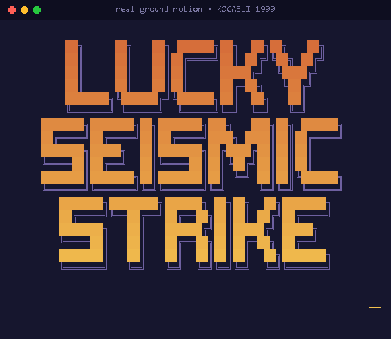
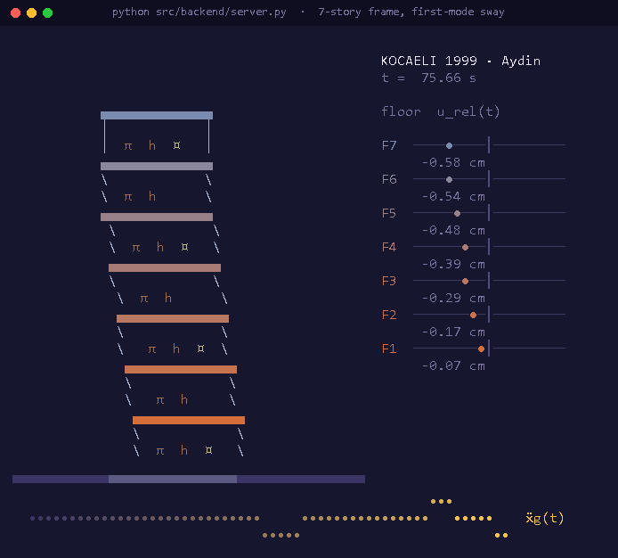
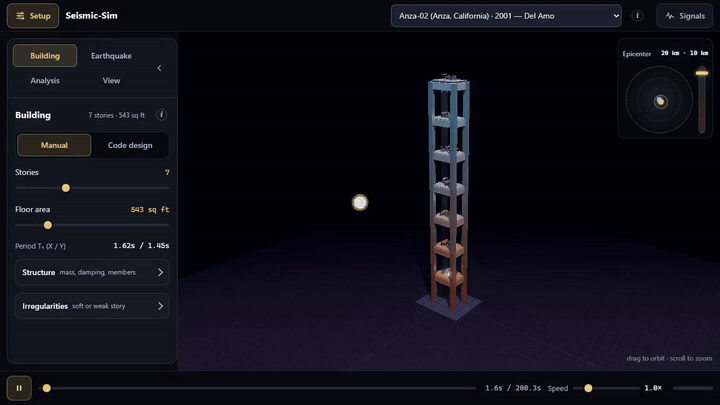
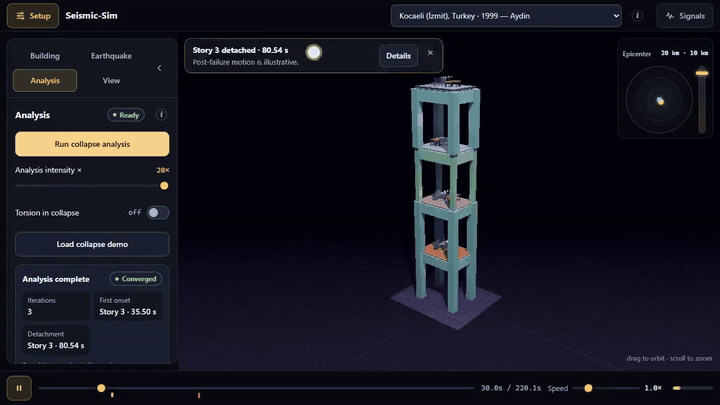
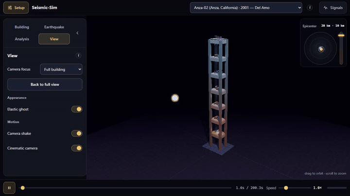
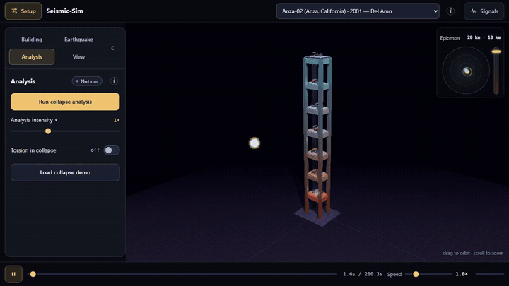
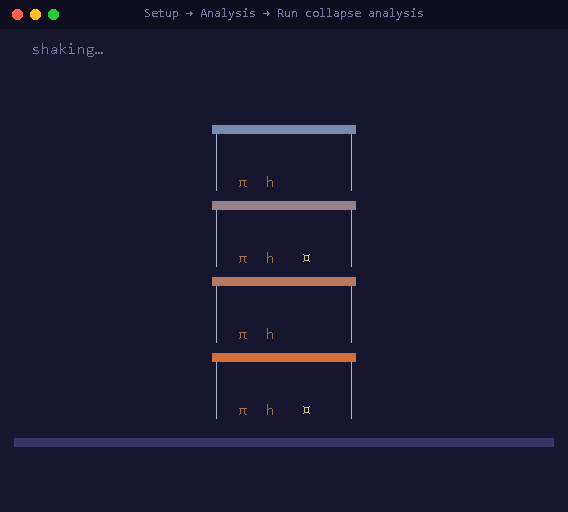
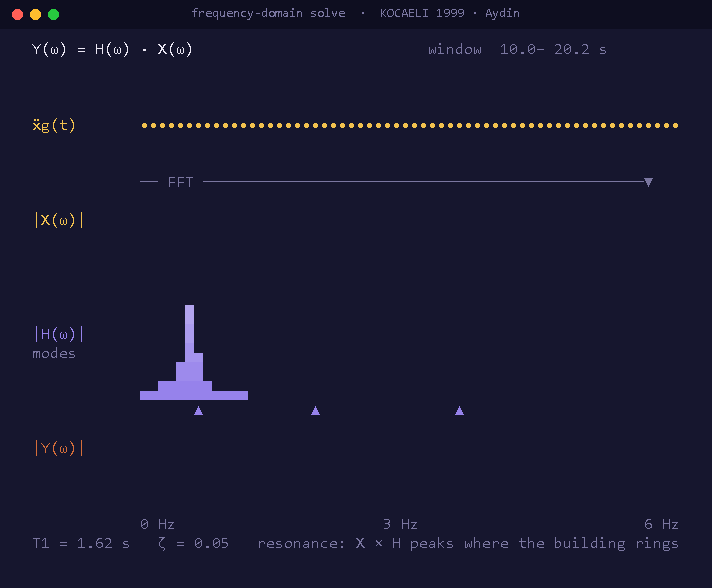
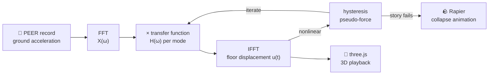

<div align="center">




<a href="https://nekrei.github.io/Seismic-Sim/">
  
</a>

<p>
  <a href="https://nekrei.github.io/Seismic-Sim/"></a>
  <a href="presentation/"></a>
</p>
<p>
  
  
  
  
  
  
</p>


<br /><sub>Every frame is the solver's real output: the default 7-story frame under Kocaeli 1999 (Aydin station).</sub>

</div>

---

## ✨ What it is

**Lucky Seismic Strike** is a 3D earthquake simulator. It takes a *real* ground-motion
recording (PEER `.AT2` / `.DT2` files from the Anza, Kocaeli, L'Aquila, Niigata and
Parkfield earthquakes), builds a reinforced-concrete frame from the dimensions you
choose, solves how every floor responds, and plays the result back as a live 3D
building. The motion you see comes from the solver's output, not a scripted animation.

Structural dynamics tools such as OpenSeesPy are powerful but hard to approach.
Friendly simulators are easy but often only animations. This project sits in between:
the physics is real and the interface is approachable.

## 🎬 Tour

<table>
  <tr>
    <td width="50%"><br/><b>Signals.</b> Ground acceleration, relative floor displacement, spectra and the transfer function, all measured from the solver.</td>
    <td width="50%"><br/><b>Hysteresis.</b> Each story's force–drift loop traced live as the columns yield and degrade.</td>
  </tr>
  <tr>
    <td width="50%"><br/><b>Cinematic camera.</b> Close-ups at collapse onset and failure, slow motion, and free orbit.</td>
    <td width="50%"><br/><b>Collapse analysis.</b> Nonlinear solve, story detachment, then a rigid-body fall.</td>
  </tr>
</table>

## 🧩 Features

| | |
|---|---|
| 🏢 **Real frame model** | Four corner columns and beams per floor. Stiffness comes from member sizes through the matrix-stiffness method with static condensation. Cracked sections and P-Δ gravity effects are included. |
| 〰️ **Frequency-domain solver** | Modal response solved with the FFT: `Y(ω) = H(ω) · X(ω)`. The *input × transfer = output* identity is checked numerically to about 1e-15. |
| 🔁 **Coupled X / Y / torsion** | A 3N-DOF model (`u_x`, `u_y`, `θ` per floor), so asymmetric buildings twist. |
| 💥 **Nonlinear collapse** | Trilinear column springs with pinched, degrading hysteresis, fed back into the FFT solver as a pseudo-force until the iteration converges. Failed stories detach and the survivor is re-assembled. |
| 🪨 **Post-failure animation** | A deterministic Rapier rigid-body fall with crushing, buckled columns, rubble and dust, starting from the solver's exact hand-off state. |
| 🌍 **What-if earthquakes** | Scale magnitude, epicentral distance and depth. Geometric spreading and frequency-dependent attenuation reshape the record's spectrum. |
| 📐 **Code design mode** | An educational equivalent-static generator (`POST /design`) that sizes members from zone, site class, occupancy and ductility. |
| 🧪 **Experiments** | Superposition, intensity sweeps and building A/B comparisons. |
| 📱 **Responsive workspace** | Setup and Signals panels, a playback bar with event markers, in-app help clips and a phone layout. |

<div align="center">

<br /><sub>Collapse onset → detachment → rigid-body fall. The event times are from the bundled collapse demo.</sub>
</div>

## ⚙️ How it works

<div align="center">

<br /><sub>A sliding window of the real record: |X(ω)| × the building's modal transfer function |H(ω)| = |Y(ω)|.</sub>
</div>



The offline pipeline precomputes every bundled record into `src/frontend/out/`, so
the static site works on its own. The Flask server recomputes live whenever you move
a building or earthquake slider, and returns a compact JSON header plus binary blocks.

## 🚀 Run it locally

```bash
git clone https://github.com/nekrei/Seismic-Sim.git
cd Seismic-Sim
pip install -r requirements.txt
python src/backend/server.py
```

Then open **http://127.0.0.1:8000/**. The server hosts the frontend and the live
`/compute` and `/design` endpoints. A plain static server loads the page, but the
sliders and collapse analysis need `server.py`.

> **Watch a collapse:** Setup → **Analysis** → **Load collapse demo** → **Run collapse
> analysis**, then press play. The demo's solve result is cached, so it loads in under
> a second.

<details>
<summary><b>Regenerating the precomputed results</b></summary>

Place PEER `.AT2`/`.DT2` records in `data/<record>/` (not included in the repo), then run:

```bash
python src/backend/mdof_response.py   # writes src/frontend/out/
python src/backend/plot_response.py   # optional static plots
```

After any solver change, refresh the collapse-demo cache while the server is running:

```bash
curl -X POST http://127.0.0.1:8000/compute -H "Content-Type: application/json" --data-binary @src/frontend/out/collapse_demo/request.json -o src/frontend/out/collapse_demo/response.bin
```
</details>

<details>
<summary><b>Hosted version</b></summary>

GitHub Pages serves the frontend and precomputed data. Live recompute goes to a separate
backend, [seismic-sim-backend](https://github.com/Raufur1234/seismic-sim-backend),
deployed on Render. Collapse analysis is available only with the local server.
</details>

## 🗂️ Project structure

```text
Seismic-Sim/
├── index.html              # redirects GitHub Pages to the app
├── requirements.txt
├── presentation/           # slides (Canva link + PDF)
├── docs/media/             # README animations
└── src/
    ├── backend/
    │   ├── mdof_response.py   # the physics: frame model, FFT solver, nonlinear collapse
    │   ├── server.py          # Flask: static files + /compute, /design, /cancel
    │   ├── code_design.py     # educational equivalent-static design generator
    │   └── plot_response.py   # static matplotlib plots
    └── frontend/
        ├── index.html         # three.js viewer, signals charts, UI
        ├── assets/            # workspace UI, help clips, earthquake facts
        └── out/               # precomputed responses for every bundled record
```

## ⚠️ Scope

This is an educational simulator. The frame is an idealised single-bay building, the
hysteresis constants and material scatter are assumptions, the fall after failure is an
illustrative rigid-body animation, and code-design constants are unverified against the
final BNBC 2020. Do not use it to design a real building.

## 👥 Team `np.interp(1, -1)`

<table>
  <tr>
    <td align="center"><a href="https://github.com/Raufur1234"><br /><b>Sheikh Raufur Rahim</b></a><br /><sub>2305010</sub></td>
    <td align="center"><a href="https://github.com/nekrei"><br /><b>M Ahsaf Abid</b></a><br /><sub>2305026</sub></td>
  </tr>
</table>

Built for **CSE 220: Signals and Linear Systems**. The slides are in [`presentation/`](presentation/) ([Canva](https://canva.link/1o6ar11hiyq76ma)).

<div align="center">

</div>
